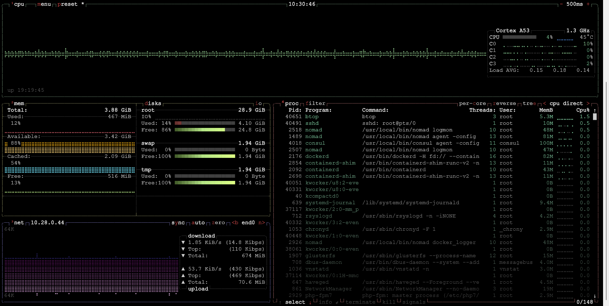

# btop is Best Top
Usually I use htop, or in the absense of that top, to do basic performance monitoring at a glance. However last week I saw someone post on lemmy about btop. And as the title says, btop is best top (IMO).

[https://github.com/aristocratos/btop](https://github.com/aristocratos/btop)



<!-- more -->

btop has most if not all the features of htop with some additions including, network activity and basic disk IO.

I was able to install it using the package manager on dietpi and Armbian. For distros though you might need to manually download and run the install script, or just compile from source.

I tried the installer script on Almalinux and CentOS 7 and it was pretty straight forward.

I'd never seen a tbz file before, but tar can handle them.

```shell
wget https://github.com/aristocratos/btop/releases/download/v1.2.13/btop-x86_64-linux-musl.tbz
tar -xjf btop-x86_64-linux-musl.tbz
cd btop
./install.sh
```
