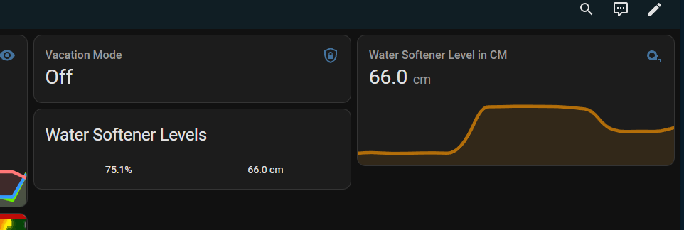
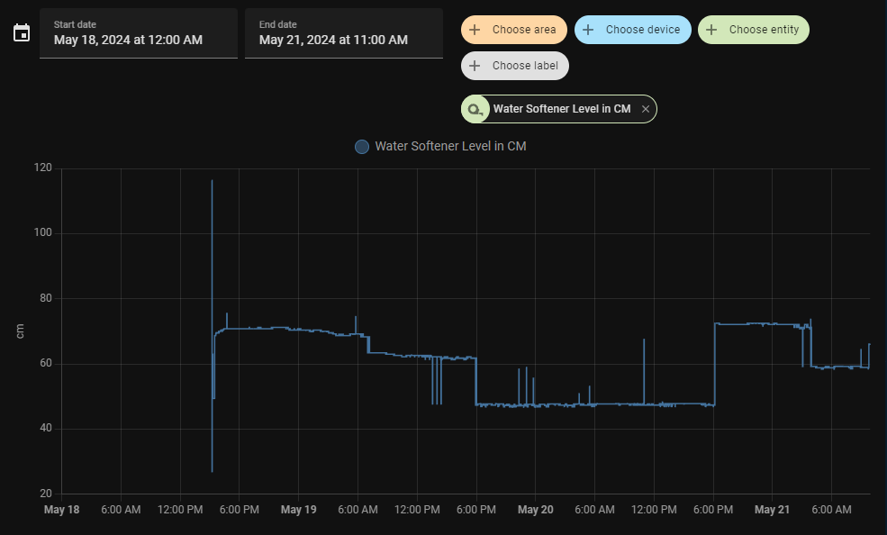

# Water Softener Sensor for Home Assistant
Recently I was suspecting my water softener wasn't working. I'd been wanting to build a salt level sensor for it for some time and my suspicion gave me the push.

## Parts and Things Used
 - wemos d1 mini (esp8266)
 - sr04 ultrasonic distance sensor
 - dupont wires
 - old KT athletic tape container (or any container that can fit the sensor and the controller)
 - microusb power supply
 - 3m dual lock fasteners
 - dremmel
 - hot glue gun

<!-- more -->

## Building the Hardware
### Wiring
I won't go into detail as there is plenty of examples online on how to wire up this sensor. It's pretty easy. I ended up using pins D6 and D7 for the trigger and echo.

### Construction
I used a dremmel to cut two round holes in one of the lids of the container for the distance sensor and another in the side of the container for the power cable. I stuck two pieces of 3m dual lock strips on the bottom to attach it to the top of the tank. I then sealed the gaps around the power cable and the sensor with hot glue.


## EspHome Code
Here is the general code I came up with for the sensor. Basically it gets the raw distance in meters. There are two template sensors. One gets the salt level in the tank in cm and the other returns the tank level in a percentage.

The one thing that will need to be changed is the sensor_hight initial value in the globals section.

```yaml
esphome:
  name: salt-level
  platform: ESP8266
  board: d1_mini

wifi:
  ssid: !secret wifi_ssid
  password: !secret wifi_password

  # Enable fallback hotspot (captive portal) in case wifi connection fails
  ap:
    ssid: "Salt Level Fallback Hotspot"
    password: "as9f87asd0f709asd7f"

captive_portal:

prometheus:

# Enable logging
logger:

# Enable Home Assistant API
api:

ota:

web_server:
  port: 80

time:
  - platform: homeassistant
    id: homeassistant_time

globals:
  id: sensor_hight
  type: float
  # change 88.0 to be the dist in cm to the bottom of the tank from the mounting point of the sensor
  initial_value: "88.0"

sensor:
  - platform: ultrasonic
    id: raw_distance
    trigger_pin: D6
    echo_pin: D7
    name: "Salt Level Raw Distance"
    disabled_by_default: true
    state_class: "measurement"
    device_class: "distance"
    accuracy_decimals: 1
    update_interval: 60s
    unit_of_measurement: "m"

  - platform: template
    id: salt_level_cm
    name: Salt Level in CM
    unit_of_measurement: "cm"
    state_class: "measurement"
    device_class: "distance"
    icon: "mdi:tape-measure"
    lambda: |-
      return id(sensor_hight)-(id(raw_distance).state*100);

  - platform: template
    name: Salt Level in Percent
    unit_of_measurement: "%"
    state_class: "measurement"
    icon: "mdi:water-percent"
    lambda: |-
      return (id(salt_level_cm).state/id(sensor_hight))*100;

  # Uptime sensor.
  - platform: uptime
    name: salt_level_sensor Uptime

  # WiFi Signal sensor.
  - platform: wifi_signal
    name: salt_level_sensor WiFi Signal
    update_interval: 60s

text_sensor:
  # Expose ESPHome version as sensor.
  - platform: version
    name: salt_level_sensor ESPHome Version
  # Expose WiFi information as sensors.
  - platform: wifi_info
    ip_address:
      name: salt_level_sensor IP
    ssid:
      name: salt_level_sensor SSID
    bssid:
      name: salt_level_sensor BSSID
```

## What you Get


As you can see it does "work". However, one of the dual lock mounts became unstuck and caused the sensor case to shift, which caused that weird jump around 6pm on the 20th. I might try [something besides the sr04](https://esphome.io/#distance), like an VL53L0X, to see if it works any better evetually, or maybe some filters. However as long as it keeps trending down, I won't be in a hurry to replace it.